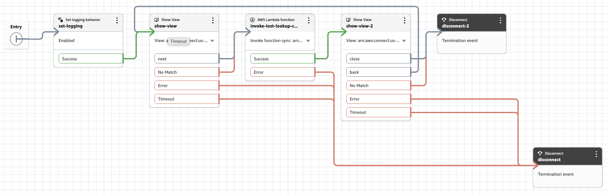

# pulumi-amazon-connect

Author Amazon Connect contact flows and views as TypeScript, deployed with Pulumi.

> [!NOTE]
> This project is an independent open-source tool and is not affiliated with, endorsed
> by, or sponsored by Amazon Web Services (AWS) or Pulumi.  Trademarks and copyrights
> are the property of their respective owners.

A flow is an ordinary function; a view is JSX. Lambdas the flow calls are deployed,
associated and permissioned from the flow itself, and the graph wiring is generated — so a transition
can never point at an action that does not exist, and a view's inputs, outputs and actions are checked
against the flow that shows it.

Requires Node 22.12 or newer.

## Getting started

### 1. Create a project

```sh
pulumi new aws-typescript
npm install pulumi-amazon-connect
```

### 2. Optional: Enable JSX for Views

Update `tsconfig.json` to use this library for jsx handling — the defaults from
`pulumi new` are too old to see this package's subpath exports:

```jsonc
{
  "compilerOptions": {
    "target": "es2022",
    "module": "nodenext",
    "moduleResolution": "nodenext",
    "strict": true,
    "esModuleInterop": true,
    "skipLibCheck": true,
    "jsx": "react-jsx",
    "jsxImportSource": "pulumi-amazon-connect"
  }
}
```

Rename `index.ts` to `index.tsx` and tell Pulumi where it is, in `Pulumi.yaml`:

```yaml
main: index.tsx
```

### 3. Configure

The view resource needs the instance ARN, and `aws-native` needs its own region:

```sh
pulumi config set aws-native:region us-east-1
pulumi config set instanceArn arn:aws:connect:us-east-1:123456789012:instance/00000000-0000-0000-0000-000000000000
```

### 4. Write `index.tsx`

```tsx
import * as pulumi from "@pulumi/pulumi";
import * as aws from "@pulumi/aws";
import * as c from "pulumi-amazon-connect";
import { Container, TextBox } from "pulumi-amazon-connect";

const config = new pulumi.Config();
/** arn:aws:connect:<region>:<account>:instance/<id> — views and flow modules need the ARN, flows the id. */
const instanceArn = config.require("instanceArn");
const instanceId = instanceArn.split("/")[1];

const basicQueue = 'arn:aws:connect:us-east-1:123456789012:instance/00000000-0000-0000-0000-000000000000/queue/f4495f9f-9859-4372-8751-71b4bdb640ee';

const functionOptions: Partial<aws.lambda.CallbackFunctionArgs<unknown, unknown>> = {
    policies: [aws.iam.ManagedPolicy.AWSLambdaBasicExecutionRole],
};

const lookupCustomer = c.connectLambda("test-lookup-customer", {
    functionOptions,
    handler: async (event: c.ContactFlowEvent<{ customerName: string }>) => {
        return { lookupResult: "Result: " + event.Details.Parameters.customerName };
    }
});

const agentView = new c.ConnectView("Pulumi Agent View", {
    instanceArn,
    view: c.defineView({
        title: "Welcome",
        actions: ["next"],
        inputs: c.shape<{ agentName: string }>(),
        outputs: c.shape<{ test: string }>(),
        body: (v) => (
            <Container>
                <TextBox>{["Welcome to the agent view, ", v.inputs.agentName]}</TextBox>
                <c.Form>
                    <c.FormInput name={v.fields.test} />
                    <c.ButtonGroup>
                        <c.GroupButton label="Submit" action={v.actions.next} formAction="submit" />
                    </c.ButtonGroup>
                </c.Form>
            </Container>
        ),
    })
});

const nextAgentView = new c.ConnectView("Pulumi Next Agent View", {
    instanceArn,
    view: c.defineView({
        title: "Next",
        actions: ["close", "back"],
        inputs: c.shape<{ test: string }>(),
        body: (v) => (
            <Container>
                <TextBox>{["Hello ", v.inputs.test]}</TextBox>
                <c.Button action={v.actions.close}>Close</c.Button>
                <c.Button action={v.actions.back}>Back</c.Button>
            </Container>
        ),
    })
});

const agentFlow = new c.ContactFlow("Pulumi Agent", {
    instanceId,
    flow: () => {
        c.setLogging("Enabled");

        const back = c.label();
        const resp = agentView.show({
            timeoutSeconds: 15,
            data: { agentName: c.system.agent.firstName },
        });

        const lookupResult = lookupCustomer({ customerName: resp.test });

        nextAgentView.show({
            on: { back: () => c.goto(back) },
            data: { test: lookupResult.lookupResult },
            timeoutSeconds: 15,
        });
        
        c.disconnect();
    },
    onError: () => {
        c.disconnect();
    }
});

const pilotFlow = new c.ContactFlow("Pulumi Pilot", {
    instanceId,
    flow: () => {
        c.setEventFlow("DefaultAgentUI", agentFlow.arn);
        c.setQueue({ queue: basicQueue });
        c.transferToQueue();
    },
    onError: () => {
        c.play("Sorry, something went wrong. Please call us back. Goodbye.");
        c.disconnect();
    }
});

// Export the name of the flow
export const pilotFlowId = pilotFlow.arn;
```

### 5. Deploy

```sh
pulumi up
```

That creates the view, the Lambda and its IAM role, the flow, and the association that lets Connect
invoke the Lambda. The flow's JSON holds the real ARNs — the view's qualified `:$LATEST` — resolved
after Pulumi creates the resources.



[docs/flows.md](docs/flows.md) covers the rest.
